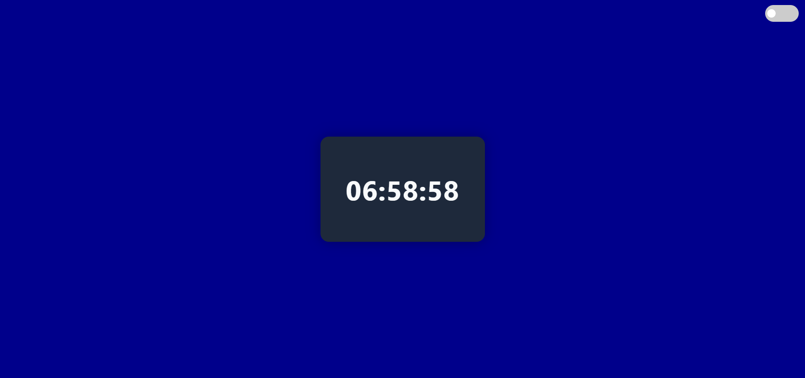

# 🕒 Digital Clock

A sleek and responsive web-based digital clock built using **HTML**, **CSS**, and **Vanilla JavaScript**. This project displays the current time in real time with an option to toggle between 12-hour and 24-hour formats. Great for beginners learning DOM manipulation and UI design.

---

## 🔗 Live Demo

👉 [Click here to view the live demo](https://bonganirampai.github.io/digital-clock/)

---

## ✨ Features

- ✅ Real-time updating digital clock
- 🌓 Toggle between **12-hour** and **24-hour** formats
- 📱 Fully responsive design for all devices
- 🎨 Easy to customize using CSS variables

---

## 🧠 How to Use

1. Open the project in your browser.
2. The time will auto-update in real-time.
3. Use the toggle button to switch between 12-hour and 24-hour display formats.

---

## 🧰 Technologies Used

HTML5 – semantic layout
CSS3 – responsive and modern design
JavaScript (ES6+) – real-time functionality and toggling logic

---

## 🙋🏽‍♂️ Author
Bongani Rampai
GitHub: [@BonganiRampai](https://github.com/BonganiRampai)

## How to reach me
- Email: [bonganerampai@gmail.com](mailto:bonganerampai@gmail.com)
- LinkedIn: [linkedin.com/in/bongani-rampai](https://linkedin.com/in/bongani-rampai)
